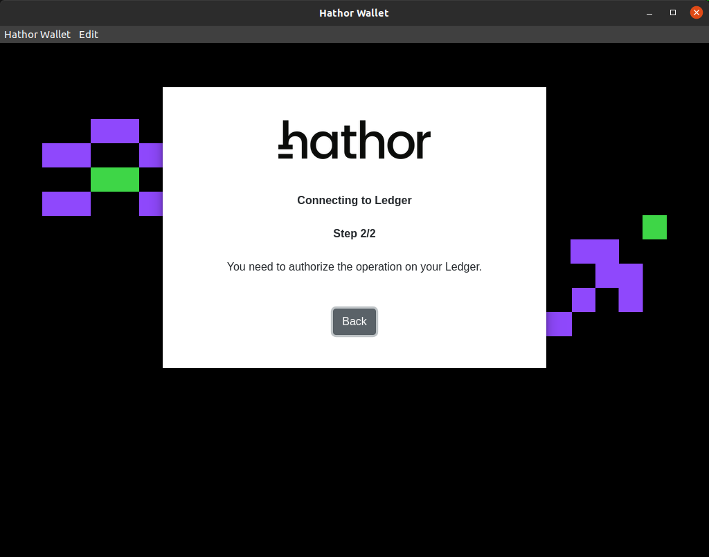
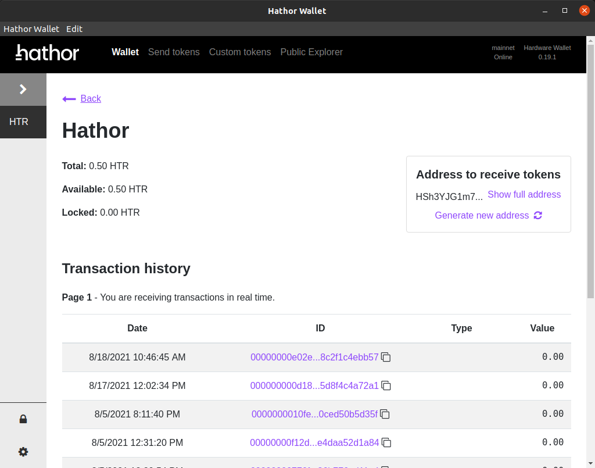

# Tutorial Wallet Desktop with Ledger Nano S

## Overview

We will teach how to connect a ledger Nano S device with Hathor wallet and how to operate the main features of the wallet with the ledger device.

### Table of contents

- [How to connect the wallet with your Nano S](#connect)
- [View transaction history](#view-transaction-history)
- [View transaction info](#view-transaction-info)
- [View public address](#view-public-address)
- [Send HTR tokens](#send-htr-tokens)

## Connect

First the device should be connected to the PC and then we should open the wallet (on the PC) and the Hathor app (on Nano S).

Once you get to the screen above open your Hathor app and select `Hardware wallet`.

When the wallet finds the Nano S and checks that the app is ready it will enter the second step.

The wallet will ask permission to access the wallet public key.

To confirm access, go to the `Approve` screen on the Nano S and press with both buttons.

Once confirmed the wallet will load your addresses and transaction history.

You are now ready to send and receive HTR tokens.

## View transaction history

The `Wallet` main screen has a list of previous transactions with basic info on the transaction and a link to view transaction info.

Information on transaction:

- Date and time of the transaction
- Id of the transaction (with link to transaction info page)
- Type (Effect on wallet balance: send, receive or no effect)
- Value (of the effect on wallet balance)

This list paginates and will go on to the first transaction found on the wallet.

## View transaction info

By clicking on the transaction id on the `View transaction History` a page with all information on the transaction opens.

Here you can check any information pertaining to the transaction.

## View public address

Your wallet has many addresses.
If you want to get one to receive tokens you need to:

- On the `Wallet` main screen upper right corner there is a box with the current address
- Click on "Show full address" to show the complete address, check your ledger device
- On the ledger device a prompt to verify the address will appear. You should verify that the address on the screen matches the address on the device.
- After checking the address you must click with both buttons on the `Verify` screen (on the ledger device)

Any errors on the address will make you lose your tokens.
Only trust addresses that match the ledger generated address.

## Send HTR tokens

Go to the "Send Tokens" screen and here you can enter which outputs your transaction is going to have.

Output info required:

- Destination address
- Value

You can add up to 255 outputs for any transaction.
Remember: The sum of the outputs values must be equal or less than your available balance.

The wallet can automatically select the inputs for the transaction.
Optionally, you can select them yourself, in wich case you need to provide for each input:

- Transaction id
- Output index (which output from transaction id will be spent)

The transaction will not be sent if the inputs total value do not match the outputs total value.
If the inputs total value exceeds the outputs total value the wallet will generate a change output with the remainder of the tokens.
(Ledger will verify that the output belongs to your wallet if it exists, so you can focus on confirming the outputs you intend to send)

Once all inputs and outputs are setup, the wallet will send this information to the Nano S and it will ask for your confirmation.

First you will need to confirm each output. Remember to check the address and values.
If all outputs are confirmed, the device will ask your permission to sign the transaction.
If confirmed, you will need to wait for the signing process to be done.
(You can also exit while the signing is ongoing, making the transaction fail)

The wallet will get the signature information and send the transaction, after which you will be directed to the `Wallet` screen.

Observations:
- Only HTR (Hathor native token) is supported with the ledger app.
- Time lock is disabled for transactions with ledger.
